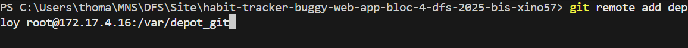
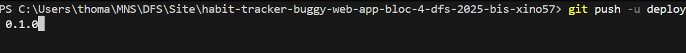
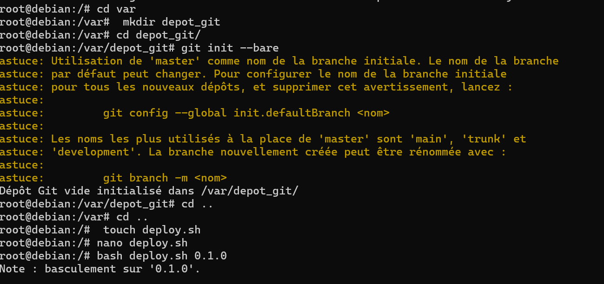
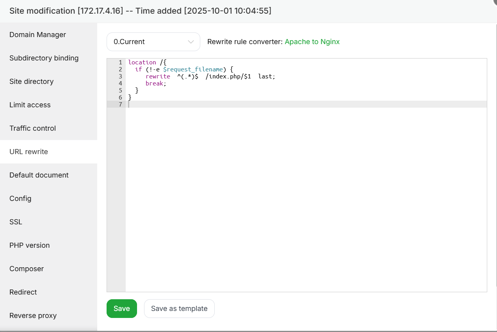
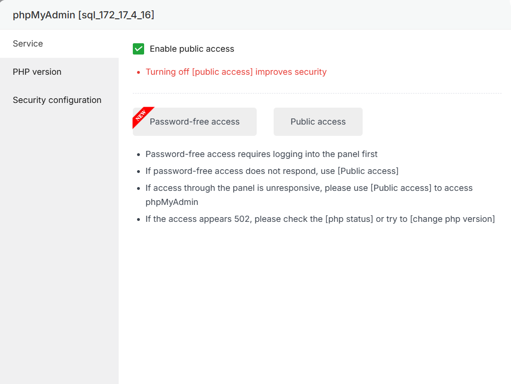
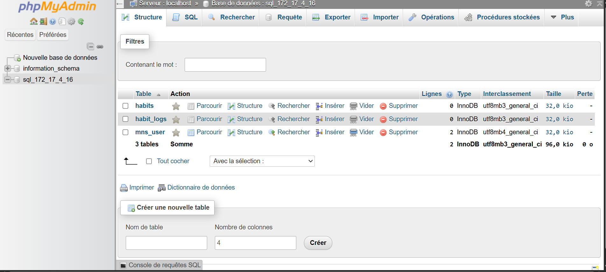
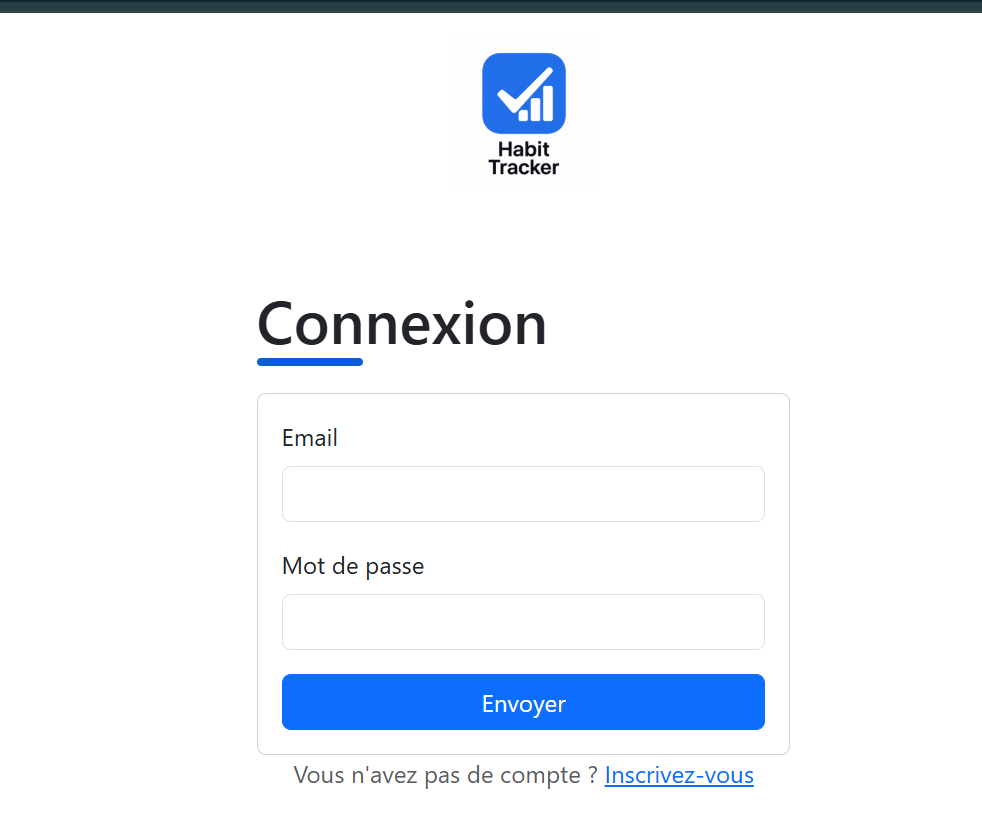
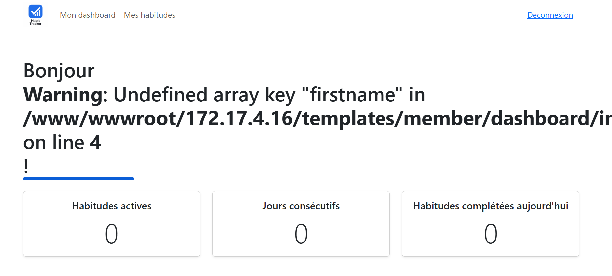
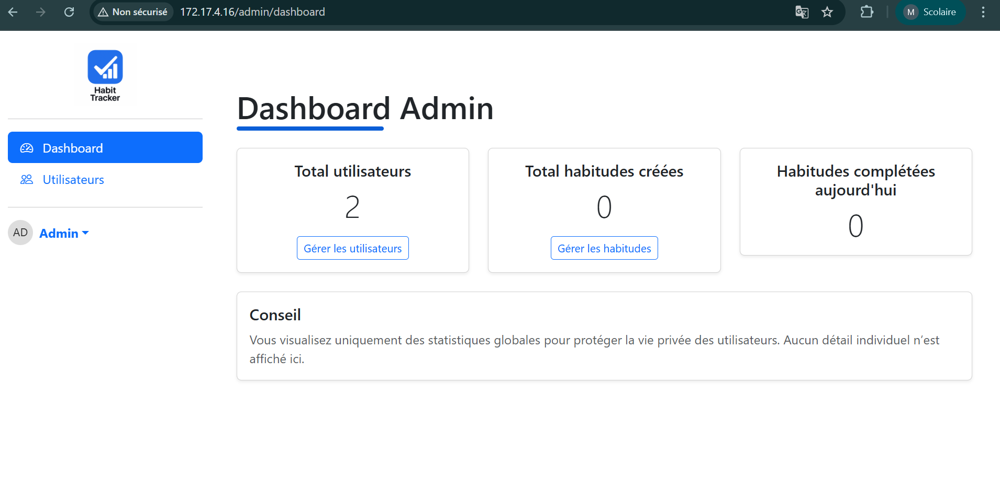

# Procédure de Déploiement

## Préparation du VPS

Pour déployer mon site web, j’ai suivi les étapes suivantes :

Premièrement, j’ai dû me connecter à ma VM **distante** en SSH, ce qui facilite la saisie de mes commandes. Je me connecte depuis mon **CMD** ou **PowerShell** selon mes préférences et je tape les commandes suivantes pour me connecter en SSH.

Je tape mon utilisateur `root@<ip>`, puis il me demande mon mot de passe afin de me connecter à mon **VPS**.

Pour mon cas ce sont les identifiant: ssh root@172.17.4 et le mot de passe est vdM58R5b
Ensuite je tape mon mot de passe qui m'a été attribué.

Premièrement, j’ai téléchargé le module **aaPanel**. aaPanel est un module d’hébergement gratuit et open-source conçu pour simplifier la gestion des serveurs sous Linux. Il me permet d’avoir une interface graphique intuitive qui permet de gérer les sites web.

J’ai utilisé la commande ci-dessous pour télécharger aaPanel dans sa version gratuite :

```bash
URL=https://www.aapanel.com/script/install_7.0_en.sh \
&& if [ -f /usr/bin/curl ]; then curl -ksSO "$URL"; \
   else wget --no-check-certificate -O install_7.0_en.sh "$URL"; fi; \
bash install_7.0_en.sh aapanel
```

Après, j’ai répondu aux différentes questions lorsque l’installation a débuté :

J’ai répondu aux trois questions par **“Yes”** afin de lancer l’installation complète.

Pour me connecter j'utilises les identifiant la:

aaPanel Internal Address: https://172.17.4.16:35072/0b55a68c
username: twrv1c6d
password: e33c3285

Ici vous avez le formulaire de connexion:


Ensuite, je me connecte avec mes identifiants qui ont été fournis par aaPanel. Lorsque je suis sur aaPanel, j’ai dû choisir un des serveurs **LAMP (LNMP)**, car il possède **Nginx**, plus rapide qu’**Apache**. Pour ma part je suis partie sur le serveur de gauche car c'est le plus rapide en installation.

Dans l’attente du téléchargement, on peut corrigé les différentes **failles de sécurité** sur le déploiement.

Pour créer la documentation de mes commits, j’ai configuré **Git Cliff** pour gérer le **CHANGELOG**, voici comment j’ai procédé :

```bash
git cliff --init
git cliff --bump -o .\CHANGELOG.md
git commit -a -m "fix: commit"
git commit -a -m "Version 1.3.0"
git tag <tag>
```

Cela me permet de faire une documentation pour mes commits et de déployer avec mes **tags**.

## Méthode de déploiement


Ensuite, lorsque les failles sont corrigées, j’ajoute le site dans aaPanel qui se trouve dans l'onglet **WebSite**. J’ajoute le **nom de domaine** de mon serveur, qui est l’adresse IP de mon **VPS** donc 172.17.4.16, si on a un **FTP**, on peut en ajouter un. Le FTP est le protocole de transfert de fichiers d’un ordinateur à un autre via un réseau internet. Ensuite, je suis allé dans l’onglet **Site Directory > Anti-XSS attack** pour la **désactiver**. Ensuite, je configure la **version de PHP** qui est trouvable dans aaPanel. Normalement déjà configuré. 

Voici la figure numéro 4 avec mon site créé


Après, je vais dans l’onglet **Base de données** et je crée ma base de données, puis j’enregistre les éléments suivants :

- Nom de la base de données
    
- Utilisateur de la base de données
    
- Mot de passe de la base de données


Voici ma base de donnée qui a été créé:


    

Voici les informations confidentielles de la base de donnée:

DBNAME:sql_172_17_4_16
USERNAME:sql_172_17_4_16
MOTDEPASSE:5084d15d490a58

Ensuite, je suis retourné dans ma machine virtuelle (VPS), à la racine de mon VPS en me déplaçant avec `cd /`, puis je suis allé dans mon dossier qui se nomme `var` en faisant `cd var`. Puis je crée mon dossier `depot_git` avec la commande `mkdir depot_git`, puis la création de mon dépôt standard dans mon VPS grâce à `git init --bare`. Donc mon dossier `depot_git` ne contient que l’historique et les données de Git, c’est-à-dire le contenu du dossier `.git`.

Lorsque que cela est fait j'ai un message comme ça:

      ```bash
      root@debian:/var/depot_git# git init --bare
      astuce: Utilisation de 'master' comme nom de la branche initiale. Le nom de la branche
      astuce: par défaut peut changer. Pour configurer le nom de la branche initiale
      astuce: pour tous les nouveaux dépôts, et supprimer cet avertissement, lancez :
      astuce:
      astuce:         git config --global init.defaultBranch <nom>
      astuce:
      astuce: Les noms les plus utilisés à la place de 'master' sont 'main', 'trunk' et
      astuce: 'development'. La branche nouvellement créée peut être rénommée avec :
      astuce:
      astuce:         git branch -m <nom>
      ```

   Cela veut dire que l'historique git a bien été initialiser

Lorsque cela est fait, je retourne dans **VS Code**, j’ouvre mon terminal et j’exécute les commandes suivantes :

```bash
git remote add deploy root@172.17.4.16:/var/depot_git
git push -u deploy <tag>
```



Dans le tag je remplace mes tags qui ont été crée aupréalable par exemple (0.1.0, 0.2.0, ect...) 

Ensuite, pour chaque nouvelle version, je pourrai utiliser la commande : `git push -u deploy <tag>` avec un nouveau tag.

Lorsque cela est fait, je peux retourner dans ma VM et aller dans le dossier `depot_git` pour taper cette commande pour **déployer** le projet sur ma machine :

```bash
git --work-tree=/www/wwwroot/172.17.4.16 --git-dir=/var/depot_git checkout -f <tag>
```

Réponse lorsque que tout c'est bien passé:

HEAD est maintenant sur c52909d feat: ajout du changeLog qui permet d'avoir la documentation de mes commits
root@debian:/# bash deploy.sh 0.2.0

Dans cette commande ci-dessous je tape le nom du tag

Pour simplifier, je peux aussi créer un script de déploiement **deploy.sh** qui permettra de ne pas taper tout le temps la commande au-dessus :

Pour s’y prendre, je crée un fichier avec la commande

```bash
# Commande pour créer le fichier deploy.sh :
touch deploy.sh
nano deploy.sh
```

```bash
# Contenu :
git --work-tree=/www/wwwroot/172.17.4.16 --git-dir=/var/depot_git checkout -f $1
```
Voir l'image pour voir toutes les commandes qui ont été réalisé depuis la création du dossier depot_git:


Lorsque cela est fait, je retourne dans aaPanel afin de terminer ma configuration de mon site. Tout d’abord, je crée le fichier **.env** et je l’enregistre directement dans l’onglet **“File”**.

 Je l'adapte en fonction de mon site:

      ```env
         DB_USER=sql_172_17_4_16
         DB_PASSWORD=5084d15d490a58
         DB_PORT=3306
         DB_HOST=127.0.0.1
         DB_NAME=sql_172_17_4_16
         DB_USERNAME=sql_172_17_4_16
         DB_PASSWORD=5084d15d490a58
      
      ```


Sinon vous devez avoir un .env comme ceci:

```env
DB_USER=sql_172_17_4_16
DB_PASSWORD=5084d15d490a58
DB_HOST=127.0.0.1
DB_NAME=sql_172_17_4_16
```

Et pour finir, je mets en place le bon **site directory**, qui se trouve dans l’onglet **Site directory > Running directory**, et je mets mon dossier **/public** là où il y a mon `index.php`. Cela permet au site de trouver directement mon `index.php`.

Voici la configuration du site:


Dans la config de mon site pour résoudre les 404 j'ai du ajouter URL Rewrite pour la bonne direction des différentes routes. Dans la liste déroulante, j'ai ajouté MVC.

Cela m'a ajouté le script suivant:

   ```php
   location /{
      if (!-e $request_filename) {
         rewrite  ^(.*)$  /index.php/$1  last;
         break;
      }
   }
   ```


Voici la capture d'écran:

   


J'ai ensuite ouvert PHPMyAdmin et j'ai apporté toutes mes données sql.
Pour ce faire, je me suis rendu dans l'onglet "DataBase" et j'ai ouvert phpMyAdmin. 





Je l'ai ouvert en public access et j'ai tapé mon nom d'utilisateur et mon mot passe qui m'ont été donné lorsque j'ai crée une base de donnée voir les données confidentielles de la base de donnée au-dessus.

Puis j'ai créer ma base de donnée en insérant les différentes requêtes sql les donnée du fichier database.sql. Comme vous pouvez le voir dans la figure numéro 12.




Pour finir mon site est accessible sur les différentes pages après toute la configuration faites:

Page login:


Dashboard Utilisateur:


Dashboard Admin:



