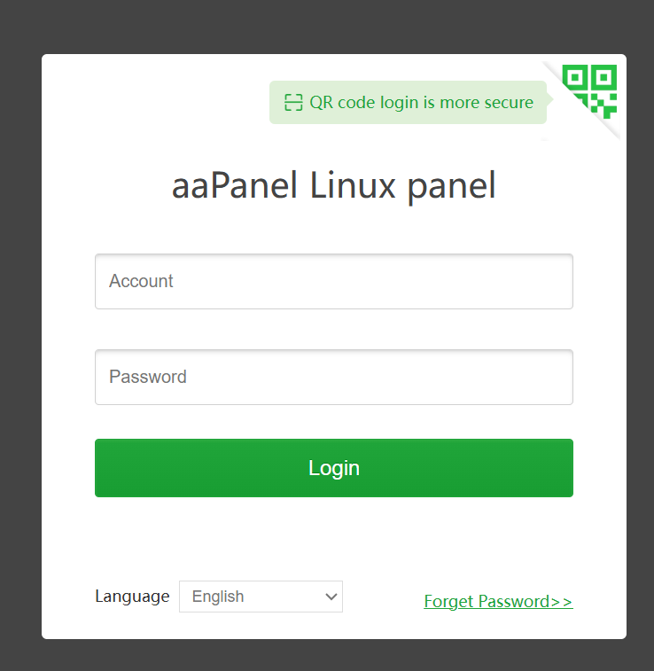
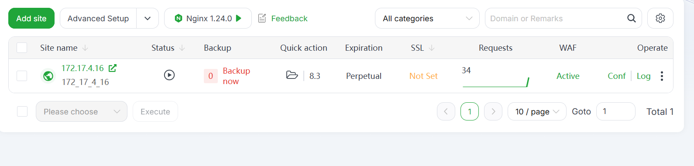
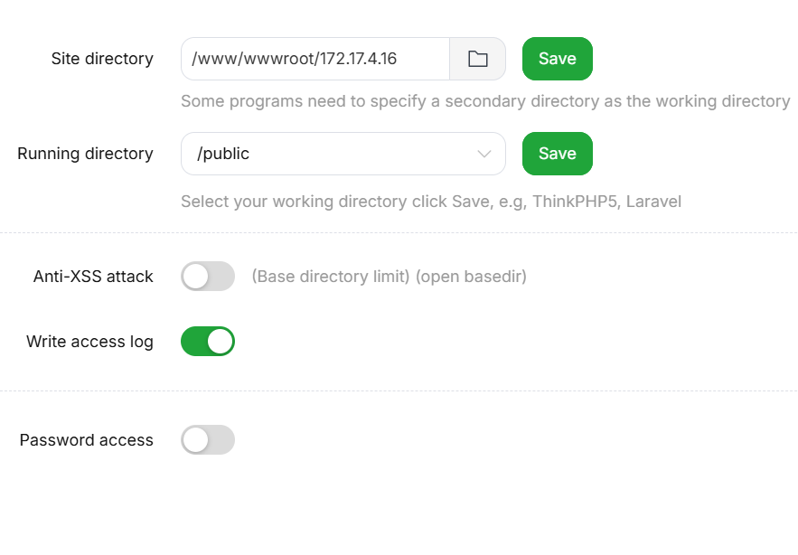
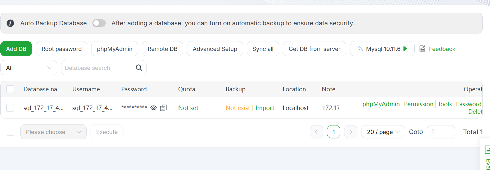

# Procédure de Déploiement

## Préparation du VPS

Pour déployer mon site web, j’ai suivi les étapes suivantes :

Premièrement, j’ai dû me connecter à ma VM **distante** en SSH, ce qui facilite la saisie de mes commandes. Je me connecte depuis mon **CMD** ou **PowerShell** selon mes préférences et je tape les commandes suivantes pour me connecter en SSH.

Je tape mon utilisateur `root@<ip>`, puis il me demande mon mot de passe afin de me connecter à mon **VPS**.

Pour mon cas ce sont les identifiant: ssh root@172.17.4 
Ensuite je tape mon mot de passe

Premièrement, j’ai téléchargé le module **aaPanel**. aaPanel est un module d’hébergement gratuit et open-source conçu pour simplifier la gestion des serveurs sous Linux. Il me permet d’avoir une interface graphique intuitive et légère qui permet de gérer les sites web, les bases de données et d’autres services.

J’ai utilisé la commande ci-dessous pour télécharger aaPanel dans sa version gratuite :

```bash
URL=https://www.aapanel.com/script/install_7.0_en.sh \
&& if [ -f /usr/bin/curl ]; then curl -ksSO "$URL"; \
   else wget --no-check-certificate -O install_7.0_en.sh "$URL"; fi; \
bash install_7.0_en.sh aapanel
```

Après, j’ai répondu aux différentes questions lorsque l’installation a débuté :

J’ai répondu aux trois questions par **“Yes”** afin de lancer l’installation complète.

Ensuite, je me connecte avec mes identifiants qui ont été fournis par aaPanel. Lorsque je suis sur aaPanel, j’ai dû choisir un des serveurs **LAMP (LNMP)**, car il possède **Nginx**, plus rapide qu’**Apache**.




Dans l’attente du téléchargement, j’ai corrigé les différentes **failles de sécurité** sur le déploiement.

Pour créer la documentation de mes commits, j’ai configuré **Git Cliff** pour gérer le **CHANGELOG**, voici comment j’ai procédé :

```bash
git cliff --init
git cliff --bump -o .\CHANGELOG.md
git commit -a -m "fix: commit"
git commit -a -m "Version 1.3.0"
git tag <tag>
```

Cela me permet de faire une documentation pour mes commits et de déployer avec mes **tags**.

## Méthode de déploiement


Ensuite, lorsque les failles sont corrigées, j’ajoute le site dans aaPanel qui se trouve dans l'onglet **WebSite**. J’ajoute le **nom de domaine** de mon serveur, qui est l’adresse IP de mon **VPS**, si on a un **FTP**, on peut en ajouter un. Le FTP est le protocole de transfert de fichiers d’un ordinateur à un autre via un réseau internet. Ensuite, je suis allé dans l’onglet **Configure > Anti-XSS** pour la **désactiver**. Ensuite, je configure la **version de PHP** qui est trouvable dans aaPanel.  



Voici la configuration du site:




Après, je vais dans l’onglet **Base de données** et je crée ma base de données, puis j’enregistre les éléments suivants :

- Nom de la base de données
    
- Utilisateur de la base de données
    
- Mot de passe de la base de données



    

Ensuite, je suis retourné dans ma machine virtuelle (VPS), à la racine de mon VPS en me déplaçant avec `cd /`, puis je suis allé dans mon dossier qui se nomme `var` en faisant `cd var`. Puis je crée mon dossier `depot_git` avec la commande `mkdir depot_git`, puis la création de mon dépôt standard dans mon VPS grâce à `git init --bare`. Donc mon dossier `depot_git` ne contient que l’historique et les données de Git, c’est-à-dire le contenu du dossier `.git`.

Lorsque cela est fait, je retourne dans **VS Code**, j’ouvre mon terminal et j’exécute les commandes suivantes :

```bash
git remote add deploy root@172.17.4.16:/var/depot_git
git push -u deploy <tag>
```

Dans le tag je remplace mes tags qui ont été crée aupréalable par exemple (0.1.0, 0.2.0, ect...) 

Ensuite, pour chaque nouvelle version, je pourrai utiliser la commande : `git push -u deploy <tag>` avec un nouveau tag.

Lorsque cela est fait, je peux retourner dans ma VM et aller dans le dossier `depot_git` pour taper cette commande pour **déployer** le projet sur ma machine :

```bash
git --work-tree=/www/wwwroot/172.17.4.16 --git-dir=/var/depot_git checkout -f <tag>
```

Dans cette commande ci-dessous je tape le nom du tag

Pour simplifier, je peux aussi créer un script de déploiement **deploy.sh** qui permettra de ne pas taper tout le temps la commande au-dessus :

Pour s’y prendre, je crée un fichier avec la commande

```bash
# Commande pour créer le fichier deploy.sh :
touch deploy.sh
nano deploy.sh
```

```bash
# Contenu :
git --work-tree=/www/wwwroot/172.17.4.16 --git-dir=/var/depot_git checkout -f $1
```

Lorsque cela est fait, je retourne dans aaPanel afin de terminer ma configuration de mon site. Tout d’abord, je crée le fichier **.env** et je l’enregistre directement dans l’onglet **“File”**.

```env
DB_USER=sql_172_17_4_16
DB_PASSWORD=5084d15d490a58
DB_HOST=127.0.0.1
DB_NAME=sql_172_17_4_16
```

Et pour finir, je mets en place le bon **site directory**, qui se trouve dans l’onglet **Site directory > Running directory**, et je mets mon dossier **/public** là où il y a mon `index.php`. Cela permet au site de trouver directement mon `index.php`.