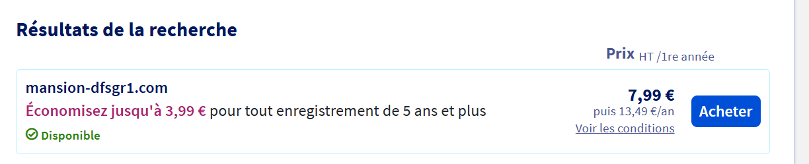
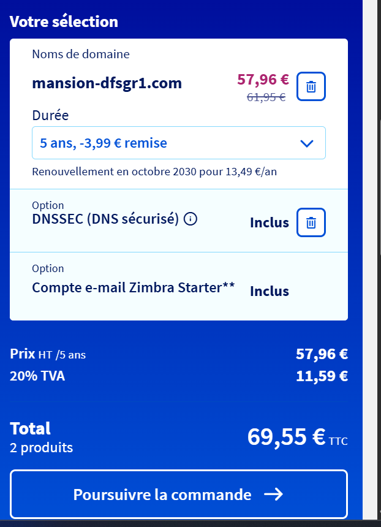
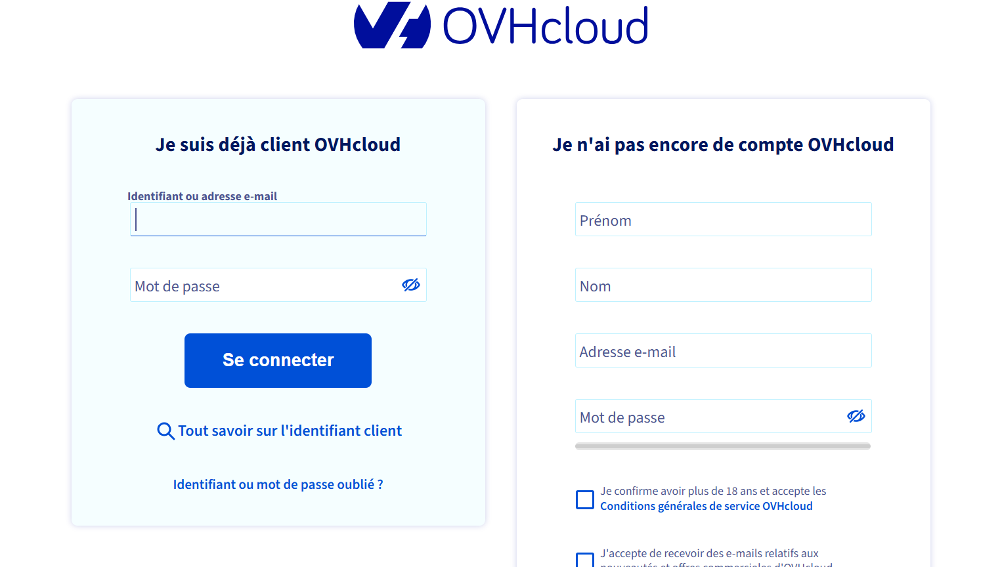

# Questions

Répondez ici aux questions théoriques en détaillant un maxium vos réponses :

1. Expliquer la procédure pour réserver un nom de domaine chez OVH avec des captures d'écran (arrêtez-vous au paiement) :

Je me suis rendu sur le site de ovh est j'ai tapé cette url pour enregistrer mon nom de domaine:

[domaineOVH](https://order.eu.ovhcloud.com/fr/webcloud/#/webCloud/domain/select?selection=~()).

Ensuite j'ai taper dans la barre de recherche pour voir si mon lien était accessible

Par exemple j'ai tapé le nom de domaine fournit : mansion-dfsgr1.com

Il est bien disponible au prix de 7.99€ par ans pusi 13.49 par ans.

Après j'ai le résumé sur les 5 années si je prends le nom de domaine:

Il me demande de lié mon domaine à mon hébergement mais pour mon cas ce n'est pas pertinent car j'ai déjà un serveur.

Je continue ma commande en appuyant sur le bouton "poursuivre ma commande"

Il me demande de me connecter et après on aura l'affichage de payement

2. Comment faire pour qu'un nom de domaine pointe vers une adresse IP spécifique ?

Une fois le nom de domaine enregistré il sera nécessaire de le rediriger vers notre serveur
en modifiant la valeur des champs A (IPv4) et AAAA (IPv6) dans la zone DNS.

- **Nom de domaine** : un domaine est réservé (ex. via OVHCloud). Les enregistrements **DNS A/AAAA** pointent vers l’adresse IPv4/IPv6 du VPS. Les éventuels NS sont correctement configurés côté registraire.
    

3. Comment mettre en place un certificat SSL ?

- **Pour le certificat SSl faire les étapes suivantes:** : via aaPanel, émission de certificats **Let’s Encrypt**, installation/renouvellement automatique, redirection **HTTP → HTTPS** et activation des bonnes pratiques (ex. HSTS si pertinent). Ces certificats couvrent le **site** et les services nécessaires.
